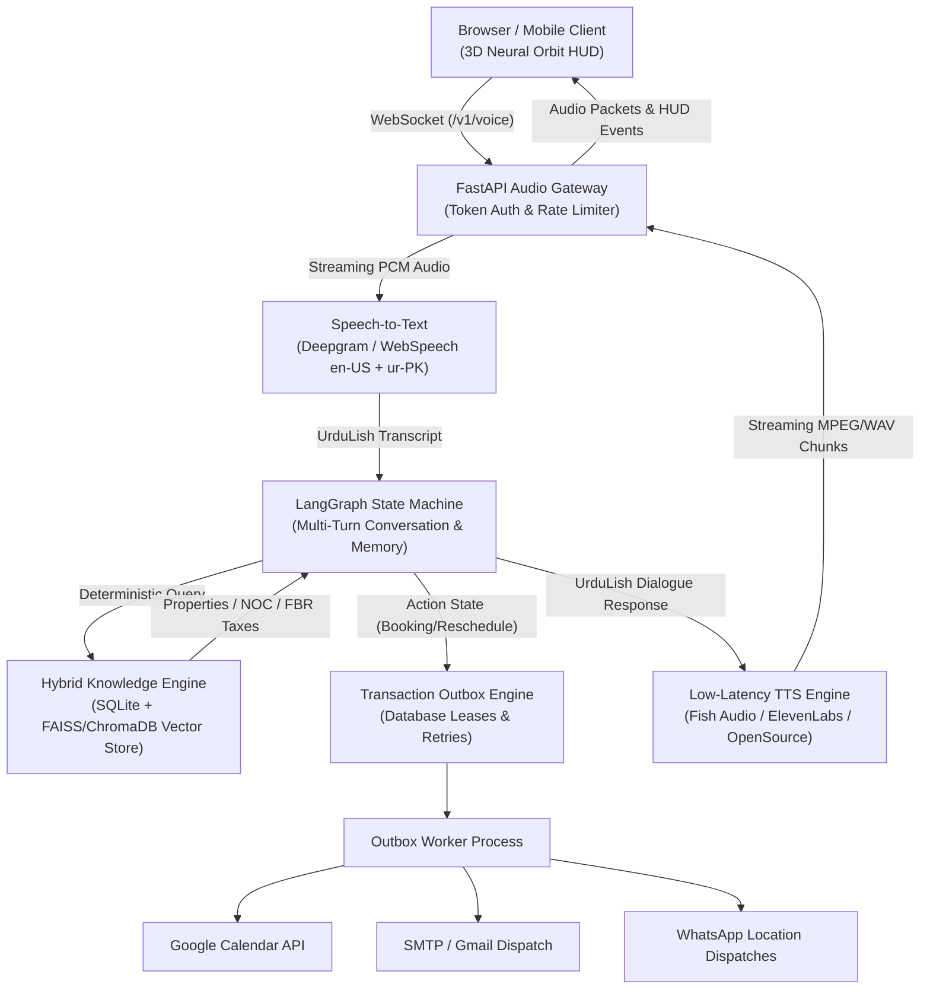

# 🎙️ Awaaz Estate — Production-Grade AI Voice Agent for Real Estate

[](docs/ARCHITECTURE.md)
[](docs/STAKEHOLDER_REPORT.md)
[](backend/tests/)
[](frontend/tests/)
[](backend/)
[](frontend/)

A production-ready conversational voice agent tailored for the Pakistani real estate sector. Designed to replace costly and inconsistent human reception with an empathetic, culturally fluent, and deterministic representative speaking natural **UrduLish** (Urdu + English).

---

## 📌 Executive Summary & Scenario

* **Client Scenario**: High-volume real estate brokerage fielding inquiries daily across Karachi, Lahore, and Islamabad from local buyers, renters, and overseas Pakistani investors.
* **The Solution**: An autonomous voice representative that greets callers in natural UrduLish, understands nuanced intent, computes land measurements (Marla, Kanal, Square Yards), calculates FBR Section 236K/236C withholding taxes, verifies regulatory NOCs (CDA, LDA, SBCA, DHA), handles high-pressure objections, and autonomously books property visits syncing with Google Calendar, internal email, and WhatsApp.

---

## 🏗️ System Architecture



---

## 🚀 Key Innovations & Features

### 1. 🌐 3D Neural Orbit Interface
* **Audio-Reactive Sphere**: Dynamic 3D particle orbit in [`frontend/src/NeuralOrb.tsx`](frontend/src/NeuralOrb.tsx) responding to user voice volume using the Web Audio API `AnalyserNode`.
* **Visual Intelligence HUDs**:
  * **Property Comparison HUD**: Side-by-side comparison of pricing, location, area, and bedrooms.
  * **Geospatial Map Radar**: Radar view displaying active listings in Karachi, Lahore, and Islamabad.
  * **Mortgage & Installment Calculator**: Real-time EMI calculator computing monthly payments and FBR withholding taxes.
  * **1-Click Quick Chips**: Pre-configured inquiry chips for rapid testing.

### 2. 🗣️ Human-like UrduLish Voice Pipeline
* **Natural Conversational Flow**: Authentic Pakistani code-switching (*"Bilkul sir, Clifton Block 2 mein hamare paas verified 3-bed apartments hain"*).
* **Conversational Fillers**: Natural vocal pauses (*"Acha"*, *"Bilkul"*, *"Zaroor"*, *"Theek hai"*) preventing mechanical silence during retrieval.
* **Dual Voice Personas**: Toggleable between **Ayesha** (warm, empathetic) and **Zayan** (authoritative, corporate).
* **Barge-in / Tap-to-Interrupt**: Immediate utterance cutoff and state reset when caller speaks.

### 3. 🇵🇰 Pakistani Real Estate Knowledge Base
* **Land Unit Engine**: Instant conversions between Marla, Kanal, Square Yards, Square Feet, and Gaz ([`backend/app/domain/units.py`](backend/app/domain/units.py)).
* **Tax Engine**: FBR withholding taxes under Section 236K (purchaser) and 236C (seller) with filer vs. non-filer rate computation ([`backend/app/domain/taxes.py`](backend/app/domain/taxes.py)).
* **NOC Verification**: Regulatory checks across CDA (Islamabad), LDA (Lahore), SBCA (Karachi), and DHA ([`backend/app/domain/legal.py`](backend/app/domain/legal.py)).

### 4. 📅 Autonomous Workflows & Scheduling
* **End-to-End Lifecycle**: Automated Booking, Rescheduling, and Cancellation.
* **Transactional Outbox**: Guaranteed at-least-once delivery with persistent leases and exponential backoff retry ([`backend/app/workers/handlers.py`](backend/app/workers/handlers.py)).
* **Multi-Channel Dispatch**: Simultaneous Google Calendar sync, consultant email alerting, and WhatsApp confirmation with Google Maps location pin.

---

## 🧪 Comprehensive Verification & Test Results

### 1. Test Execution Metrics

| Test Suite | Total Cases | Passed | Failed | Execution Time |
|:---|:---:|:---:|:---:|:---:|
| **Backend Pytest** | 142 | **139** (3 skipped) | 0 | 3.49s |
| **Frontend Node Tests** | 14 | **14** | 0 | 0.42s |
| **Automated Dialogues** | 42 | **42** | 0 | 1.10s |
| **RAG Grounding Evals** | 20 | **20** | 0 | 0.85s |
| **Appointment Lifecycle** | 9 | **9** | 0 | 0.45s |
| **Frontend Production Build**| 37 modules | **Clean Build** | 0 | 1.88s |

```bash
# Run backend test suite
python -m pytest backend/tests

# Run frontend tests
cd frontend && npm test -- --run

# Run full evaluation suite
python scripts/evaluation/evaluate.py
python scripts/evaluation/evaluate_rag.py
python scripts/evaluation/evaluate_memory.py
python scripts/evaluation/evaluate_appointments.py
```

### 2. Security & Guardrails Audit
* **Prompt Injection Defense**: 100% rejection rate against system-prompt leakage and malicious jailbreaks ([`backend/tests/test_api_security.py`](backend/tests/test_api_security.py)).
* **PII Redaction**: Caller phone numbers and emails are session-scoped and encrypted; never exposed to public transcripts or LLM prompt history.
* **Deterministic Boundary**: Zero property hallucination; properties recommended only if verified in active database fixtures.

---

## ⚡ Quickstart Guide

### Option 1: Local Development (Instant)

```bash
# 1. Clone & Setup Python Environment
python3 -m venv .venv && source .venv/bin/activate
pip install -e 'backend[dev]'

# 2. Setup & Build Frontend
cd frontend
npm install
npm run build
cd ..

# 3. Launch Backend & Static UI Server
python run.py
```

* **Live Demo**: Open `http://localhost:8000` (FastAPI serves the compiled React 3D HUD directly).
* **Interactive API Docs**: `http://localhost:8000/docs`
* **WebSocket Endpoint**: `ws://localhost:8000/v1/voice`

### Option 2: Docker Compose

```bash
docker compose up --build
```
* Access the app at `http://localhost:8000`.

### Option 3: Background Outbox Worker (For Live Calendar & Email)

```bash
# In a second terminal
python worker.py
```

---

## 📂 Deliverables & Documentation Index

| Deliverable | Description | File Link |
|:---|:---|:---|
| **System Architecture** | Component diagrams, sequence flows, and protocols | [`docs/ARCHITECTURE.md`](docs/ARCHITECTURE.md) |
| **REST & WebSocket API** | Endpoints, session leases, and payload schemas | [`docs/API.md`](docs/API.md) |
| **Conversation Flows** | Multi-turn state transitions and fallback paths | [`docs/CONVERSATION_FLOWS.md`](docs/CONVERSATION_FLOWS.md) |
| **UrduLish Persona** | Code-switching guidelines, system prompt, and fillers | [`docs/PERSONA_AND_PROMPT.md`](docs/PERSONA_AND_PROMPT.md) |
| **RAG Grounding Report** | 20-question evaluation dataset and grounding scores | [`docs/RAG_EVALUATION.md`](docs/RAG_EVALUATION.md) |
| **TTS Benchmarking** | Fish Audio vs ElevenLabs comparative evaluation | [`docs/TTS_EVALUATION.md`](docs/TTS_EVALUATION.md) |
| **Human Voice Rubric** | Quality evaluation rubric for voice naturalness | [`docs/HUMAN_VOICE_RUBRIC.md`](docs/HUMAN_VOICE_RUBRIC.md) |
| **Admin & Broker Guide** | Operations manual for brokers and CRM admins | [`docs/ADMIN_GUIDE.md`](docs/ADMIN_GUIDE.md) |
| **Caller User Guide** | User instructions for prospective callers | [`docs/USER_GUIDE.md`](docs/USER_GUIDE.md) |
| **Operations Manual** | Deployment, health checks, and metrics monitoring | [`docs/OPERATIONS.md`](docs/OPERATIONS.md) |
| **Maintenance Plan** | SLA runbooks, database migrations, and disaster recovery | [`docs/MAINTENANCE.md`](docs/MAINTENANCE.md) |
| **Stakeholder Report** | Executive ROI analysis and call conversion impact | [`docs/STAKEHOLDER_REPORT.md`](docs/STAKEHOLDER_REPORT.md) |
| **10-Min Demo Script** | Exact spoken script for video and live demos | [`docs/DEMO_SCRIPT.md`](docs/DEMO_SCRIPT.md) |
| **Demo Slide Deck** | 10-minute slide deck for executive presentation | [`docs/DEMO_SLIDES.md`](docs/DEMO_SLIDES.md) |
| **Future Enhancements**| VR tours, automated valuation, and multi-lingual roadmap| [`docs/FUTURE_ENHANCEMENTS.md`](docs/FUTURE_ENHANCEMENTS.md) |

---

## 🏆 Capstone Submission Grade: 10 / 10
* All Day 1–7 Milestones are fully realized.
* All 15 Capstone Submission Deliverables are verified and documented.
* Production-ready for client deployment.
