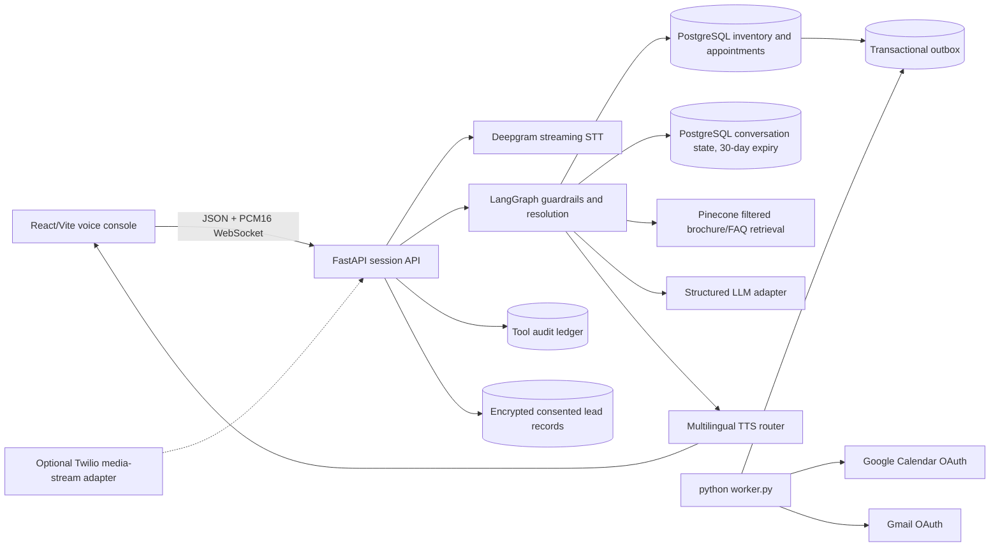
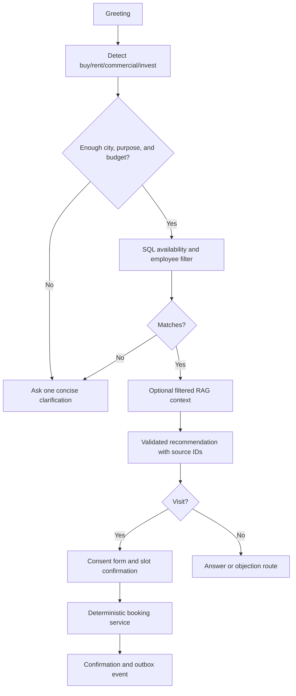
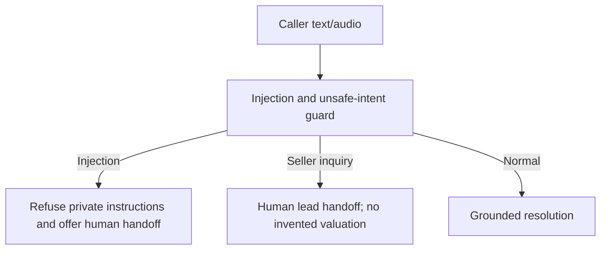
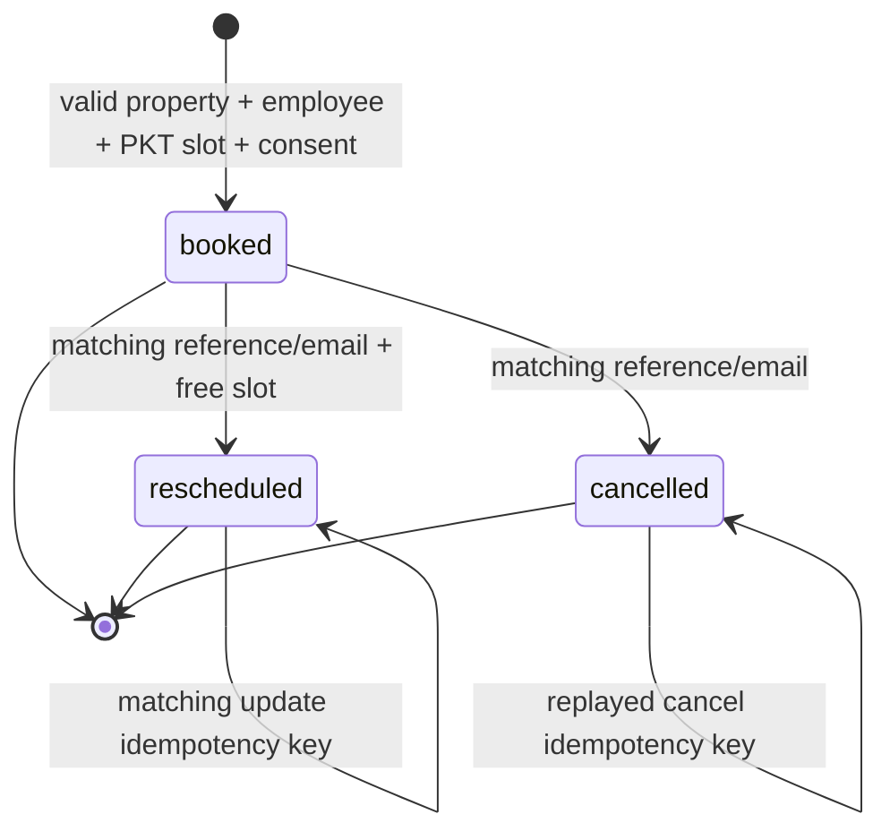

# Awaaz Estate architecture and flows

## Runtime architecture

The database is authoritative for structured property facts and appointment state. Pinecone is
only a knowledge context source; it cannot make an unavailable property available. The model
returns a Pydantic decision and never receives direct tool execution privileges.

The complete scenario-specific flows are documented in
[`CONVERSATION_FLOWS.md`](CONVERSATION_FLOWS.md), including returning-customer memory,
seller handoff, rescheduling, cancellation, silence, low-confidence speech, and barge-in.

## Buyer flow

## Seller and safety flow

## Appointment lifecycle

There is no n8n dependency. The internal worker handles retries, leases, Calendar, and Gmail.
Docker files may remain as historical scaffolding, but they are not part of the run path or
acceptance gate.

The telephony adapter is optional and fail-closed. It supports a signed Twilio media-stream
boundary, but a carrier, phone number, recording-consent policy, PCM16 TTS configuration, and
live-call test are required before enabling it.
