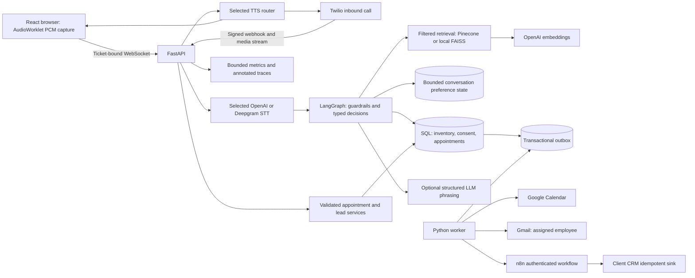
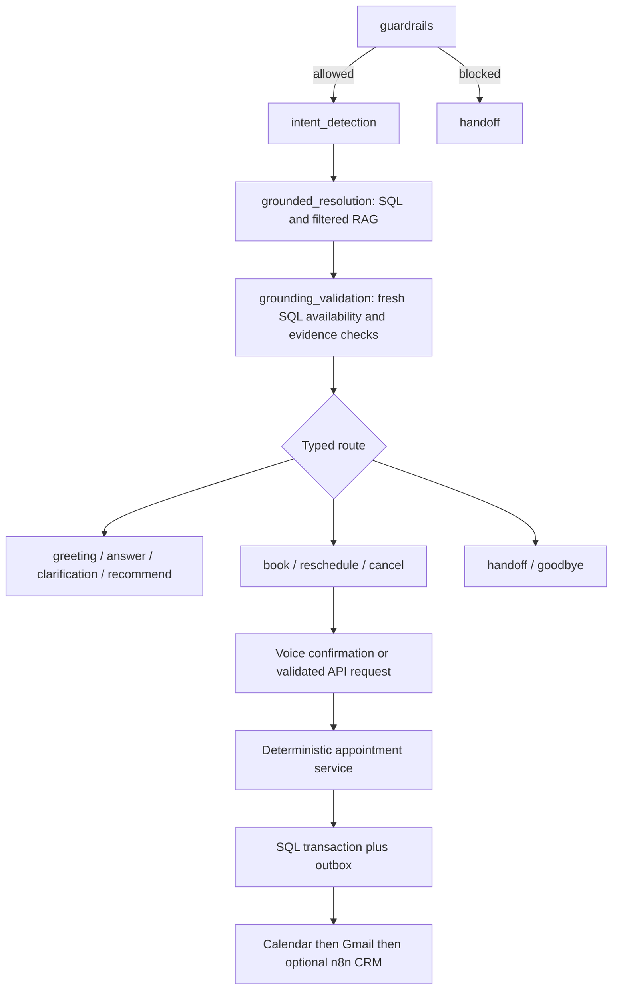

# Awaaz Estate architecture

## Runtime and trust boundaries

`python run.py` starts the API. `python worker.py` independently delivers outbox events.
React is served by Vite during development or from the built frontend by FastAPI.
PostgreSQL is the intended operational database; SQLite supports local development.
Docker and Compose package the API, frontend, worker, migrations and PostgreSQL; the optional
n8n profile prepares workflow execution. Actual deployment is deferred by the user.

## Speech turn

Capture → PCM frames → streaming STT → final transcript → guardrails → SQL/RAG → typed
answer → streamed TTS → browser playback. Voice activity detection closes a spoken turn;
barge-in cancels active playback/response. Empty turns return to listening. Browser UI exposes
listening/thinking/speaking/failure states, device selection, explicit stop and a manual reply
fallback. A socket opening is not proof of a completed voice turn. Measure speech-end to first
audible output, including provider and playback time, before claiming the under-two-second goal.

OpenAI browser speech is supported alongside Deepgram and configurable Fish Audio, ElevenLabs,
OpenAI and isolated OSS TTS adapters. Configuration readiness does not establish quality or
successful delivery. A real incoming phone call additionally needs Twilio credentials, a number,
a public TLS endpoint, suitable audio encoding and a carrier acceptance test.

## Agent graph and business actions

The graph logs guardrails, detection, resolution, grounding validation and the selected route. Route nodes express a
decision; they do not grant the LLM permission to write Calendar or send email. RAG runs within
grounded resolution; email is an outbox action, not a standalone LangGraph node. This is an
explicit architecture difference from the brief's illustrative graph, with the same business
stages split across trusted services. API validation remains authoritative for consent,
contact identity, exact appointment date/time, employee ownership, availability and idempotency.
Spoken confirmation never removes those checks. Employee email is an operator-managed mapping,
not an address invented by the model.

Conversation state includes bounded history, profile/preferences, budget, intent, retrieved
sources, selected properties, tool results, appointment status and escalation reason. State
memory supplies preferences; current SQL is rechecked for property and appointment facts.

## Structured facts and RAG

SQL owns prices, sizes, availability, employees and appointments because these need exact,
transactional checks. Brochures, FAQs and descriptive material use loaders, chunking, embeddings
and a metadata-filtered vector store. Pinecone is the hosted option; FAISS supports persistent
local retrieval using JSON metadata and real embedding vectors. Retrieval failure produces a
safe fallback. Model property/source IDs must belong to supplied evidence, including mixed
valid/forged citation rejection. Source IDs are useful evidence pointers, not a proof that every
natural-language claim is correct; review representative answers against company source material.
Production inventory starts empty. Synthetic evaluation fixtures are not client inventory.

## Delivery, security and limits

Appointment and outbox writes share a transaction. Leased worker claims, bounded backoff and
persisted provider receipts support retries without redoing already recorded deliveries. Remote
provider acceptance followed by a process crash can still leave an ambiguous email send;
exactly-once Gmail delivery is not promised. The inactive n8n export verifies upstream receipts
and requires a committed, idempotent CRM acknowledgement. See [workflow contract](../workflows/n8n/README.md).

Admin endpoints require operator authentication outside development. Browser voice uses one-use,
short-lived, origin/client-bound tickets and shared database quotas/leases. Contacts are encrypted,
transcripts redacted, raw audio not persisted by runtime, and conversation retention is 30 days.
Metrics are bounded in-process snapshots, not a durable distributed monitoring service. See
[maintenance](MAINTENANCE.md) for export/alert and recovery requirements.

See [scenario flowcharts](CONVERSATION_FLOWS.md), [API](API.md), and
[requirement matrix](CAPSTONE_REQUIREMENTS.md) for implementation boundaries.
