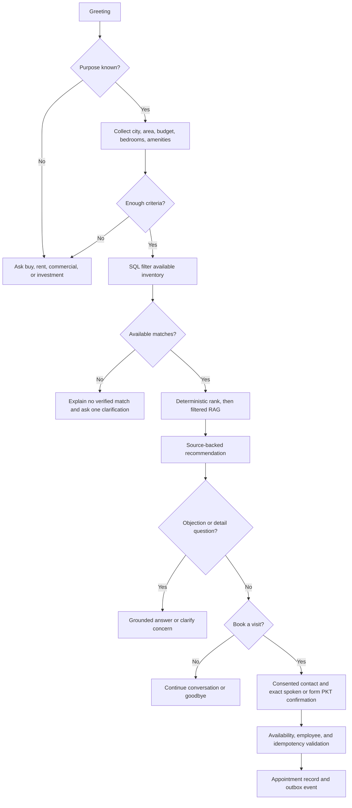
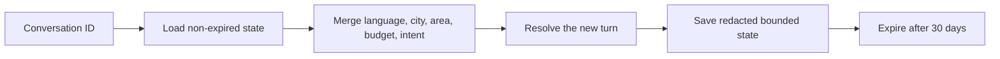
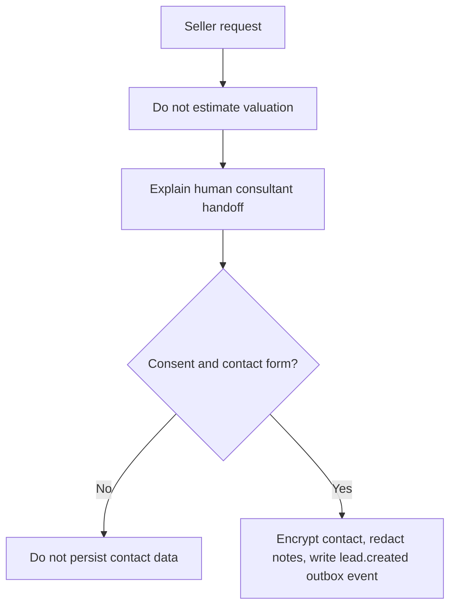
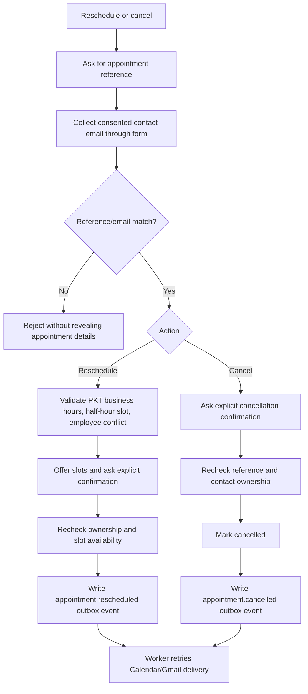
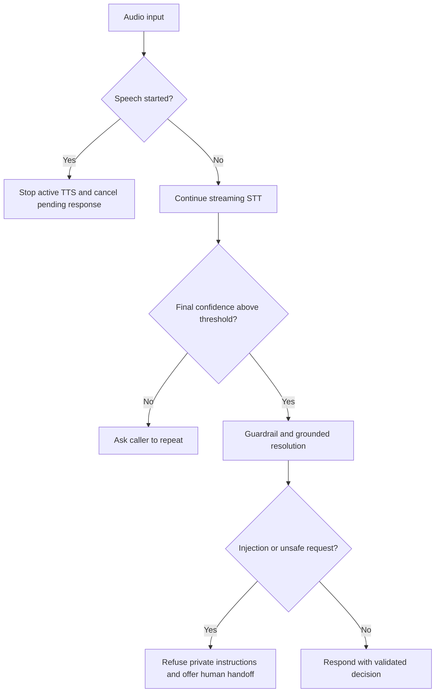

# Conversation flows

These flows describe the deterministic boundary around the voice model. The model may phrase a
response, but it cannot decide availability, create an appointment, or disclose an unverified
fact. Every consequential transition passes through a validated service. Voice actions require
explicit spoken confirmation and contact consent from the form.

## Buyer, rental, commercial, and investment

## Returning customer and memory

The state is a preference memory, not a source of property truth. Inventory and appointment
facts are always re-checked against SQL.

## Seller or valuation request

## Reschedule and cancellation

## Silence, low confidence, interruption, and injection

